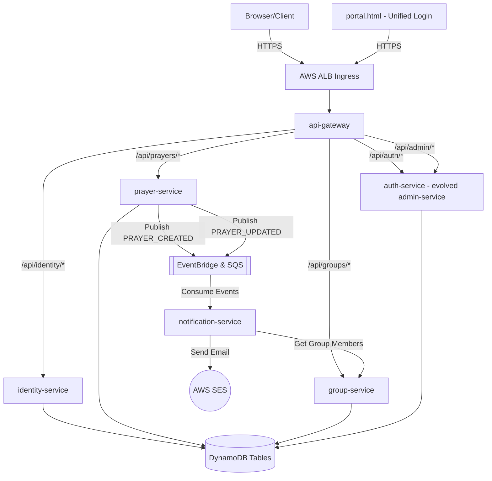
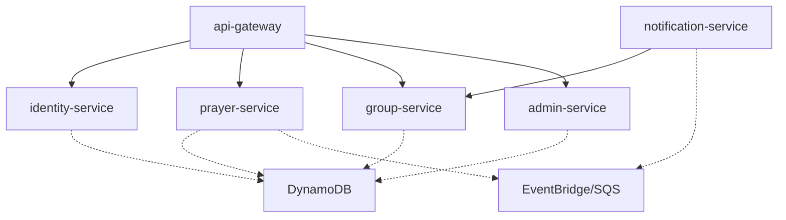

# Prayer Link Master Implementation Plan

This document outlines the implementation strategy for Prayer Link, moving from the foundational infrastructure up to the complete frontend experience.

## Project Summary

Prayer Link is a platform connecting people needing prayer with intercessors in their community. It focuses on absolute minimal friction for requesters (no login, device fingerprinting) while providing reliable delivery of prayer requests to intercessors via email. The system is built with a serverless data layer, event-driven microservices, and a fast, minimal vanilla JS frontend.

## Documentation Index

### Architecture Decision Records (ADRs)
- [ADR-001: Frontend Technology](adrs/ADR-001-frontend-technology.md) - Vanilla HTML/CSS/JS with Vite.
- [ADR-002: Database](adrs/ADR-002-database-dynamodb.md) - Amazon DynamoDB.
- [ADR-003: Messaging](adrs/ADR-003-inter-service-messaging.md) - Amazon EventBridge & SQS.
- [ADR-004: Deployment](adrs/ADR-004-deployment-ecs.md) - Amazon ECS with Fargate.
- [ADR-005: User Identity](adrs/ADR-005-user-identity-device-fingerprinting.md) - Best-effort device fingerprinting (cookie + localStorage).
- [ADR-006: Notification Strategy](adrs/ADR-006-notification-strategy.md) - AWS SES email, future WhatsApp.
- [ADR-007: API Gateway](adrs/ADR-007-api-gateway-pattern.md) - Spring Cloud Gateway.
- [ADR-008: Observability Stack](adrs/ADR-008-observability-stack.md) - Prometheus + Grafana.
- [ADR-009: Security Model](adrs/ADR-009-security-model.md) - Layered auth (Device IDs, HMAC tokens, Admin JWTs).

### Product Requirements Documents (PRDs)
- [PRD-001: Prayer Submission Flow](prds/PRD-001-prayer-submission-flow.md) - Submission, group selection, round-robin.
- [PRD-002: Returning User Experience](prds/PRD-002-returning-user-experience.md) - Floating prayers, detail view, updates.
- [PRD-003: Intercessor Flow](prds/PRD-003-intercessor-flow.md) - Email notifications, action page, token validation.
- [PRD-004: Admin Panel](prds/PRD-004-admin-panel.md) - Group/member management, dashboard, role-based access.
- [PRD-005: Infrastructure & Deployment](prds/PRD-005-infrastructure-and-deployment.md) - Monorepo, CDK, CI/CD, local dev.
- [PRD-006: Frontend Design System](prds/PRD-006-frontend-design-system.md) - Visual design, CSS structure, accessibility.
- [PRD-007: Intercessor Prayer Viewing](prds/PRD-007-intercessor-prayer-viewing.md) - Group prayer browsing from email links, HMAC token evolution.
- [PRD-008: Intercessor Accounts](prds/PRD-008-intercessor-accounts.md) - Intercessor registration, login, and personal prayer portal.
- [PRD-009: Unified Login & Role-Based Access](prds/PRD-009-unified-login-role-based-access.md) - Single `/portal` entry point, role-based views, admin migration.

## System Architecture

## Service Dependency Graph

## Implementation Phases

### Phase 1: Foundation (Infrastructure & Scaffolding)
Establish the monorepo, local development environment, and core AWS infrastructure.

**Tasks:**
1. Initialize the monorepo structure (frontend, services, infra folders).
2. Create the Maven Parent POM defining Spring Boot versions, shared dependencies, and the Jib plugin.
3. Create the `shared-lib` module for common DTOs, Event records, and exception handling.
4. Set up `docker-compose.yml` with DynamoDB Local and LocalStack for local dev.
5. Initialize the Vite frontend project with essential CSS structure (tokens, reset).
6. Implement the AWS CDK application in `infra/cdk` defining the Network, Database, and Messaging stacks.
7. Create the basic GitHub Actions CI pipeline (`ci.yml`) for linting and testing.
8. Scaffold the `api-gateway` Spring Boot service with basic routing configuration.

**Dependencies:** None.
**Estimated Complexity:** M
**Acceptance Criteria:** Local `docker-compose up` works. All services compile. CDK synth generates valid CloudFormation templates.

---

### Phase 2: Core Backend Services (Identity & Prayer)
Implement the core domain services for registering devices and saving prayers.

**Tasks:**
1. Implement `identity-service`:
   - `POST /api/identity/register` (create DeviceID, set cookie).
   - `PUT /api/identity/{id}/seen`.
   - `GET /api/identity/me`.
2. Implement `group-service` (Core):
   - Group and GroupMember CRUD (basic internal API).
   - `GET /api/groups/validate` (passcode check).
3. Implement `prayer-service`:
   - `POST /api/prayers` (Create prayer).
   - Integration with `group-service` for round-robin assignment.
   - Publish `PRAYER_CREATED` event to EventBridge.
   - `GET /api/prayers?deviceId={id}` (List prayers).
   - `GET /api/prayers/{prayerId}` (Get details).

**Dependencies:** Phase 1.
**Estimated Complexity:** L
**Acceptance Criteria:** Can register a device, create a prayer, see it saved in DynamoDB (local), and verify the event is published to EventBridge.

---

### Phase 3: Notification Pipeline
Connect the event-driven system to deliver emails to intercessors.

**Tasks:**
1. Implement `notification-service`:
   - Consume `PRAYER_CREATED` from SQS via EventBridge rule.
   - Implement HMAC token generation.
   - Integrate AWS SES SDK for sending emails.
   - Create HTML/text email templates for new prayers.
2. Implement Intercessor Action API in `prayer-service`:
   - `POST /api/prayers/{prayerId}/prayed`.
   - Implement HMAC token validation.
   - Implement idempotency checks and `prayedForCount` increment.
3. Add `PRAYER_UPDATED` event handling to `prayer-service` and `notification-service`.

**Dependencies:** Phase 2.
**Estimated Complexity:** M
**Acceptance Criteria:** Creating a prayer locally triggers a console-logged email (or real SES email if configured). Simulating the token POST request increments the prayer count.

---

### Phase 4: Frontend MVP
Build the user-facing web application.

**Tasks:**
1. Implement the CSS Design System (variables, typography, components).
2. Create the animated background (CSS blob animations).
3. Build the Landing Page and Prayer Submission Flow (multi-step form, QR scanner, API integration).
4. Build the Returning User View (floating prayer pills, dynamic layout based on API response).
5. Build the Prayer Detail View (modal/slide-in, update submission).
6. Build the Intercessor Action Page (`pray.html` - parse URL token, render prayer, submit action).

**Dependencies:** Phases 1, 2, and 3.
**Estimated Complexity:** L
**Acceptance Criteria:** A user can walk through the entire flow via the browser: submit a prayer, "receive" an email link, mark it as prayed, see the count update, and submit a closing update.

---

### Phase 5: Admin Panel & Security
Implement the administrative interface and secure access.

**Tasks:**
1. Implement `admin-service`:
   - Setup and Login endpoints (bcrypt + JWT generation).
   - Admin CRUD and Role enforcement (APP_ADMIN vs GROUP_ADMIN).
   - Group and Member management endpoints (proxying/calling `group-service`).
   - Prayer dashboard endpoint (paginated queries).
2. Configure Spring Cloud Gateway:
   - Add CORS configuration.
   - Add rate limiting (Redis/In-memory).
   - Add global `X-Device-ID` validation filter.
3. Build the Frontend Admin Panel:
   - Login view.
   - Sidebar and layout.
   - Group and Member tables (with bulk CSV import).
   - Prayer Dashboard.

**Dependencies:** Phase 2.
**Estimated Complexity:** M
**Acceptance Criteria:** An admin can log in, create a group, add members, and view submitted prayers. Security controls prevent unauthorized access.

---

### Phase 5A: Intercessor Prayer Viewing
Emails still alert intercessors, but clicking the link opens a full prayer view with group context.

**Tasks:**
1. Evolve `pray.html` / `pray.js` — After rendering the target prayer card, fetch and display an "Other prayers in your group" section below it.
   - New API call: `GET /api/prayers?groupId={assignedGroupId}&status=OPEN` (already exists, just needs to be called from the intercessor page).
   - Each prayer card shows the prayer text, created date, and prayer count.
   - Clicking a card expands it inline with its own "I have prayed" button (reusing the same HMAC token mechanism — the token is scoped to the group, not a single prayer).
2. Modify HMAC token scope — Currently tokens encode `{prayerId}:{email}:{expiry}`. Evolve to also encode `{groupId}` so the frontend can extract the group context:
   - New token format: `Base64URL(HMAC-SHA256(key, "{prayerId}:{groupId}:{email}:{expiry}")) | {groupId} | {expiry}`
   - prayer-service validation updated to parse the new format.
   - Backwards-compatible: old tokens (2-part split on `|`) still validate with the legacy flow.
3. Create prayer-service endpoint for group prayer listing — `GET /api/prayers/group/{groupId}?token={intercessorToken}`
   - Validates the intercessor token to confirm group membership.
   - Returns all OPEN prayers for that group (paginated, max 50).
   - Does NOT require `X-Device-ID` (intercessor context).
4. Update email templates — The email CTA text changes from "I've Prayed For This 🙏" to "View Prayer & Pray 🙏" to reflect the richer experience.
5. Frontend UI enhancements to `pray.html`:
   - Group name header at the top of the page.
   - Two-column layout on desktop: target prayer (left/top), group prayers list (right/bottom).
   - Mobile: stacked single column.
   - Each prayer card has an inline "Pray" micro-button.

**Dependencies:** Phase 5.
**Estimated Complexity:** M
**Acceptance Criteria:** Clicking an email link shows the target prayer AND other group prayers. Intercessor can mark prayers as prayed-for from the group list. Old-format email links still work. No login required.

---

### Phase 5B: Intercessor Accounts
Intercessors get email/password accounts so they can log in and access their prayer groups without needing an email link.

**Tasks:**
1. [x] Extend `identity-service` with intercessor account management:
   - `POST /api/identity/intercessor/register` — accepts `{ email, password, name }`. Validates that the email exists as a group member. Hashes password with BCrypt. Creates a record in a new `IntercessorAccounts` DynamoDB table.
   - `POST /api/identity/intercessor/login` — validates credentials, returns a JWT cookie (`pl-intercessor-token`).
   - `GET /api/identity/intercessor/me` — returns profile + group memberships.
   - `POST /api/identity/intercessor/logout` — clears cookie.
2. [x] New DynamoDB table: `IntercessorAccounts` (PK: `email`, with `passwordHash`, `name`, `createdAt`).
3. [x] New frontend page: `intercessor.html` — Intercessor portal:
   - Login view: Email + password form. Link to "Create Account" (registration form).
   - Registration view: Email + name + password + confirm password. On submit, validates email is a known group member.
   - Dashboard view (post-login): Sidebar listing groups, prayer list for selected group, inline "I have prayed" buttons, visual indicator for already-prayed prayers.
   - Reuses the existing design system (tokens, components, layout CSS).
4. [x] Intercessor JWT validation in `api-gateway`:
   - New route: `/api/intercessor/**` → `intercessor.html` assets and API calls.
   - The gateway passes the `pl-intercessor-token` cookie through to `identity-service` for validation.
5. [x] Email "View in Portal" link — Add a secondary link in prayer notification emails: "Or log in to your Prayer Link portal to view all prayers." linking to `/intercessor.html#login`.
6. [x] Registration invitation flow — When an admin adds a member to a group, the system can optionally send an invitation email with a link to `/intercessor.html#register?email={email}` pre-filling the email field.

**Dependencies:** Phase 5A.
**Estimated Complexity:** L
**Acceptance Criteria:** Intercessor can register with an email that belongs to a group. Intercessor can log in and see their group's prayers. Prayers already prayed-for are visually distinct. "I have prayed" works from the portal (no HMAC token needed — JWT auth used instead). Email notifications still work independently. Registration rejects emails not associated with any group.

---

### Phase 5C: Unified Login & Role-Based Access
Replace the separate `admin.html` with a single `/portal` entry point. All roles — App Admin, Group Admin, and Intercessor — log in to the same page and see role-appropriate views.

**Tasks:**
1. Unify authentication in `admin-service` (evolve to `auth-service`):
   - `POST /api/auth/login` — accepts `{ identifier, password }`. The `identifier` can be a username (admin) or email (intercessor). The service checks `Admins` table first, then `IntercessorAccounts`.
   - Returns a unified JWT with claims: `{ sub, role, groupId?, email? }` where `role` is one of `APP_ADMIN`, `GROUP_ADMIN`, `INTERCESSOR`.
   - `GET /api/auth/status` — replaces `/api/admin/status`. Returns `{ authenticated, role, groupId, initialized, username/email }`.
   - `POST /api/auth/logout` — clears the unified cookie.
   - All existing `/api/admin/*` endpoints continue to enforce `APP_ADMIN` or `GROUP_ADMIN` roles.
2. Single cookie: `pl-auth-token` — replaces both `pl-admin-token` and `pl-intercessor-token`. Simplifies gateway cookie forwarding.
3. New frontend: `portal.html` + `portal.js`:
   - Login view: Single form with "Email or Username" + "Password" fields. "Create Intercessor Account" link below.
   - Post-login routing based on role: `APP_ADMIN` sees full admin dashboard; `GROUP_ADMIN` sees their circle and prayers; `INTERCESSOR` sees their groups and can mark prayers.
   - Admin views migrated from `admin.js`. Intercessor views migrated from `intercessor.html`.
4. Retire `admin.html` — visiting `/admin.html` redirects to `/portal.html`.
5. Retire `intercessor.html` — merge into `portal.html`, redirect `/intercessor.html` to `/portal.html`.
6. Gateway route updates: `/api/auth/**` → auth-service. `/api/admin/**` → auth-service (role-checked). Remove separate intercessor token cookie handling.
7. First-time setup preserved — If no admins exist, `/portal` still shows the setup form.
8. Email link behaviour update — Email prayer links (`/pray/{prayerId}/{token}`) continue to work without login but show a banner linking to `/portal.html`.

**Dependencies:** Phase 5B.
**Estimated Complexity:** L
**Acceptance Criteria:** Single login page at `/portal.html` works for all three roles. App Admins see the full admin dashboard. Group Admins see their circle and its prayers. Intercessors see their group(s) and can mark prayers as prayed-for. `/admin.html` redirects to `/portal.html`. Email prayer links still work without login. First-time setup flow is preserved. Role escalation is impossible.

---

### Phase 6: ECS Fargate Deployment & CI/CD
Move the application from local development to the AWS cloud.

**Tasks:**
1. Finalize the AWS CDK stacks (ECS, ECR, Route53, ACM).
2. Create ECS task definitions and service configs via CDK.
3. Complete the GitHub Actions pipeline (`deploy.yml`) to build Jib images, push to ECR, and deploy ECS services.
4. Configure S3 bucket and CloudFront distribution for the static frontend.
5. Deploy to a staging/dev environment and run end-to-end smoke tests.

**Dependencies:** Phases 1-5C.
**Estimated Complexity:** L
**Acceptance Criteria:** The application is accessible via a public domain name over HTTPS, and code merges to `main` automatically deploy.

---

### Phase 7: Observability & Hardening (Post-MVP)
Ensure the system is production-ready, monitored, and resilient.

**Tasks:**
1. Configure AMP and AMG workspaces via CDK with ADOT sidecars.
2. Add Micrometer custom business metrics to all services (prayers created, emails sent, etc.).
3. Configure Grafana dashboards and alerting rules.
4. Implement SES Bounce handling (SNS topic -> `notification-service` -> `group-service` update).
5. Load testing and ECS Service Auto Scaling tuning.

**Dependencies:** Phase 6.
**Estimated Complexity:** M
**Acceptance Criteria:** Dashboards show real-time metrics. Alerts fire correctly when errors are simulated.

## Next Action for Development Agents
Phases 1 through 5 are **complete**. Agents should begin with **Phase 5A: Intercessor Prayer Viewing**, starting with evolving the HMAC token scope, creating the group prayer listing endpoint, and enhancing the `pray.html` frontend.
